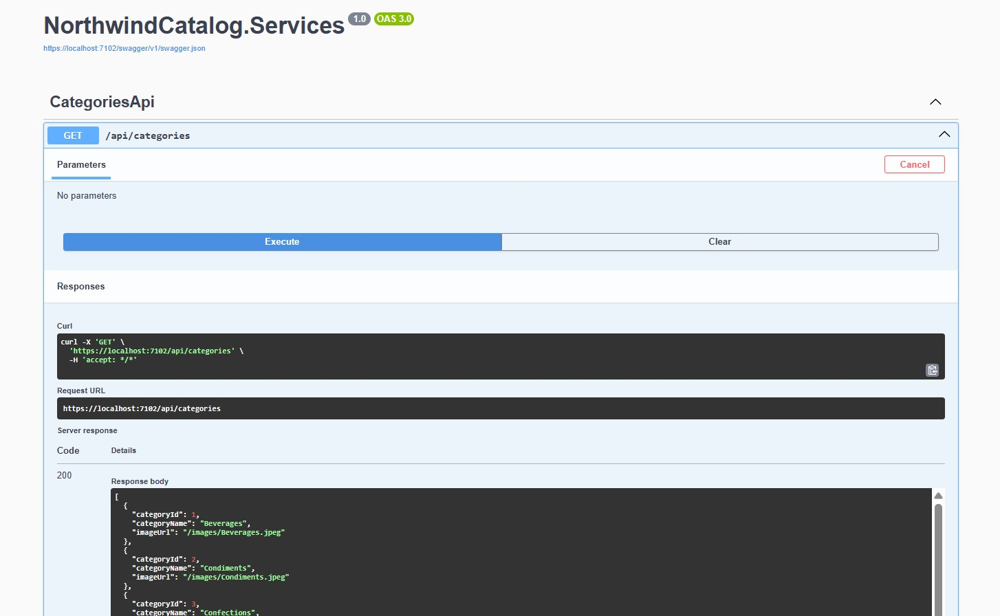
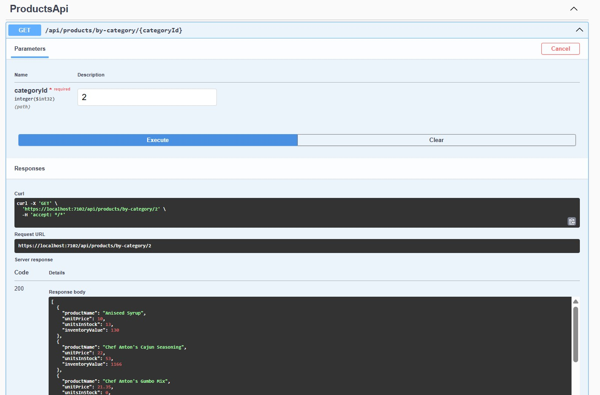
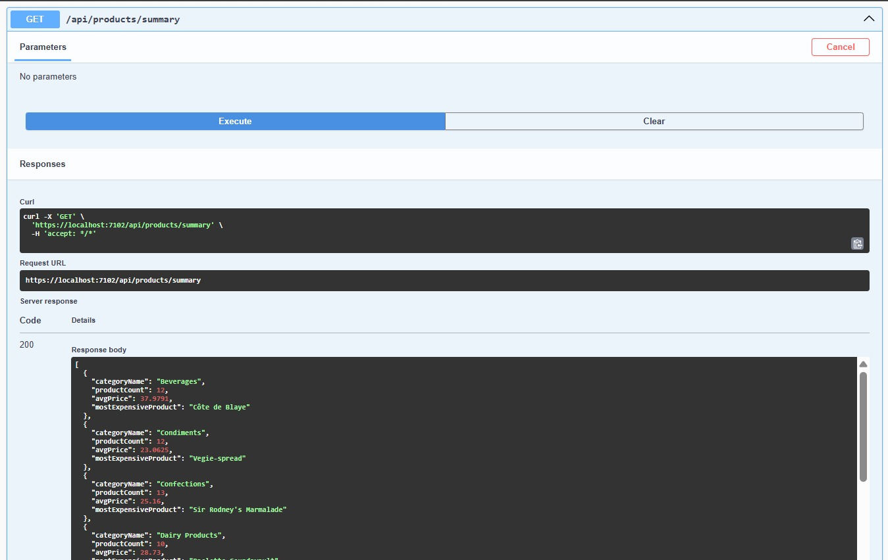
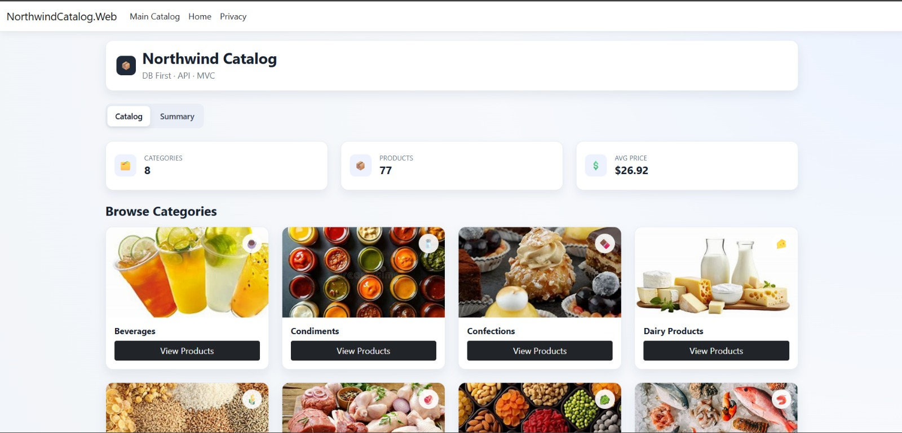
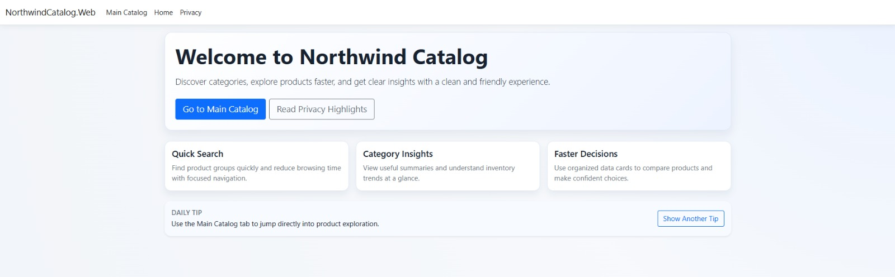
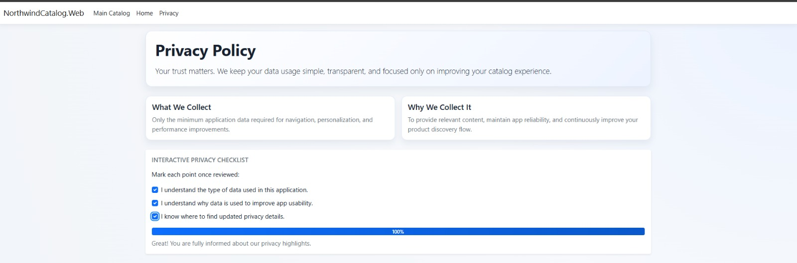

# NorthwindCatalog Project Documentation (.NET 8)

This document provides complete project documentation for the **NorthwindCatalog** Week 15 assessment implementation.

## 1) Project Overview

**NorthwindCatalog** is a 3-project .NET 8 solution that demonstrates:

- DB First (EF Core) over the Northwind database
- Repository pattern for data access
- REST APIs for categories, products, and summary analytics
- ASP.NET Core MVC web UI consuming API endpoints via `HttpClient`
- DTO mapping through AutoMapper
- Interactive frontend enhancements on Home/Privacy/Catalog pages
- Test project scaffold using xUnit

### Primary Goals

- Read Northwind catalog data (Categories, Products)
- Expose clean API endpoints
- Consume APIs in MVC web app
- Display catalog + summary analytics
- Deliver enhanced UX with interactive UI behaviors

## 2) Solution Structure

```text
NorthwindCatalog
├── NorthwindCatalog.Services   (API + EF Core + Repository + AutoMapper)
├── NorthwindCatalog.Web        (MVC UI + API consumption)
└── NorthwindCatalog.Tests      (xUnit test project)
```

### A) NorthwindCatalog.Services (API Layer)

**Responsibilities**

- Data access using EF Core
- Repository pattern implementation
- Domain-to-DTO mapping using AutoMapper
- API endpoints for categories, products, and category summary

**Important Files**

- `Program.cs`
- `NorthWindContext.cs`
- `Category.cs`
- `Product.cs`
- `CategoryDto.cs`
- `ProductDto.cs`
- `CategorySummaryDto.cs`
- `MappingProfile.cs`
- `ICategoryRepository.cs`
- `CategoryRepository.cs`
- `IProductRepository.cs`
- `ProductRepository.cs`
- `CategoriesApiController.cs`
- `ProductsApiController.cs`
- `appsettings.json`
- `launchSettings.json`

### B) NorthwindCatalog.Web (Presentation Layer)

**Responsibilities**

- Render UI through Razor Views
- Consume backend API via `IHttpClientFactory`
- Build page data using DTOs + view models
- Support interactive frontend behavior (search/filter/tips/checklist)

**Important Files**

- `Program.cs`
- `CatalogController.cs`
- `HomeController.cs`
- `INorthwindApiClient.cs`
- `NorthwindApiClient.cs`
- `CategoryDto.cs`
- `ProductDto.cs`
- `CategorySummaryDto.cs`
- `CategoryIndexViewModel.cs`
- `Views/Catalog/Index.cshtml`
- `Views/Home/Index.cshtml`
- `Views/Home/Privacy.cshtml`
- `Views/Shared/_Layout.cshtml`
- `wwwroot/css/site.css`
- `wwwroot/js/site.js`
- `appsettings.json`
- `launchSettings.json`

### C) NorthwindCatalog.Tests (Testing Layer)

**Responsibilities**

- Unit/integration testing container
- Current status: baseline setup with minimal implementation

**Important Files**

- `UnitTest1.cs`
- `NorthwindCatalog.Tests.csproj`

## 3) Tech Stack and Packages

### Framework

- .NET 8

### API and Web

- ASP.NET Core
- ASP.NET Core MVC
- ASP.NET Core Web API

### Data

- Entity Framework Core
- `Microsoft.EntityFrameworkCore.SqlServer`

### Mapping

- AutoMapper
- `AutoMapper.Extensions.Microsoft.DependencyInjection`

### API Documentation

- Swagger / OpenAPI
- `Swashbuckle.AspNetCore`

### Frontend

- Razor Views
- Bootstrap
- Custom CSS
- Vanilla JavaScript

### Testing

- xUnit
- `Microsoft.NET.Test.Sdk`
- `coverlet.collector`

## 4) Configuration

### Services `appsettings.json`

```json
"ConnectionStrings": {
  "Default": "Data Source=msi\\sqlexpress;Initial Catalog=NorthWind;Integrated Security=True;Encrypt=True;Trust Server Certificate=True"
}
```

Used by:

- `NorthwindContext` through DI configuration in `Program.cs`

### Web `appsettings.json`

```json
"ApiSettings": {
  "BaseUrl": "https://localhost:7102/"
}
```

Used by:

- named `HttpClient` (`NorthwindApi`)

## 5) API Project Detailed Design (NorthwindCatalog.Services)

### Startup (`Program.cs`)

Registers:

- `AddControllers()`
- Swagger (`AddEndpointsApiExplorer`, `AddSwaggerGen`)
- AutoMapper with `MappingProfile`
- `DbContext<NorthwindContext>` with SQL Server
- Repository services as scoped dependencies

Pipeline:

- Swagger UI in development
- HTTPS redirection
- Authorization middleware
- `MapControllers()`

### Data Model

#### `NorthwindContext`

Exposes:

- `DbSet<Category> Categories`
- `DbSet<Product> Products`

Fluent API config includes:

- `UnitPrice` mapped to `decimal(10,2)`
- Product-category relationship configured (`CategoryId` foreign key)

#### `Category` Entity

- `CategoryId`
- `CategoryName`
- `Description`
- `Picture`
- `Products` navigation

#### `Product` Entity

- `ProductId`
- `ProductName`
- `SupplierId`
- `CategoryId`
- `QuantityPerUnit`
- `UnitPrice`
- `UnitsInStock`
- `UnitsOnOrder`
- `ReorderLevel`
- `Discontinued`
- `Category` navigation

### DTO Contracts

#### `CategoryDto`

- `CategoryId`
- `CategoryName`
- `ImageUrl`

#### `ProductDto`

- `ProductName`
- `UnitPrice`
- `UnitsInStock`
- Computed: `InventoryValue = UnitPrice * UnitsInStock`

#### `CategorySummaryDto`

- `CategoryName`
- `ProductCount`
- `AvgPrice`
- `MostExpensiveProduct`

### AutoMapper (`MappingProfile`)

Maps:

- `Category -> CategoryDto`
  - Builds `ImageUrl` as `/images/{CategoryName}.jpeg` with slash sanitization
- `Product -> ProductDto`

### Repository Layer

#### `ICategoryRepository`

- `GetAllAsync()`

#### `CategoryRepository`

- Returns all categories via EF Core `ToListAsync()`

#### `IProductRepository`

- `GetByCategoryIdAsync(int categoryId)`
- `GetCategorySummariesAsync()`

#### `ProductRepository`

- `GetByCategoryIdAsync(int)`:
  - Filters products by `CategoryId`
- `GetCategorySummariesAsync()`:
  - Groups by category navigation
  - Computes product count, average price, and most expensive product

### API Controllers and Endpoints

#### Categories API Controller

Route: `api/categories`

- `GET /api/categories`
  - Returns mapped `CategoryDto[]`

#### Products API Controller

Route: `api/products`

- `GET /api/products/by-category/{categoryId}`
  - Returns mapped `ProductDto[]`
- `GET /api/products/summary`
  - Returns `CategorySummaryDto[]`

## 6) Web Project Detailed Design (NorthwindCatalog.Web)

### Startup (`Program.cs`)

Registers:

- `AddControllersWithViews()`
- named `HttpClient` (`NorthwindApi`) using `ApiSettings:BaseUrl`
- API client service:
  - `INorthwindApiClient -> NorthwindApiClient`

Routing:

- Default route points to catalog page:
  - `{controller=Catalog}/{action=Index}/{id?}`

### Service Layer (`NorthwindApiClient`)

Uses `IHttpClientFactory` for endpoints:

- categories
- products by category
- summary

Methods:

- `GetCategoriesAsync()`
- `GetProductsByCategoryAsync(int categoryId)`
- `GetCategorySummaryAsync()`

Null-safe fallback:

- Returns `Enumerable.Empty<T>()` when API response is null

### MVC Controllers

#### `CatalogController`

`Index(int? categoryId, string? tab)`:

- Determines active tab (`catalog` or `summary`)
- Always loads categories and summary data
- Loads products only when category is selected on catalog tab
- Builds `CategoryIndexViewModel`

`Summary()`:

- Redirects to `Index(tab = "summary")`

#### `HomeController`

- `Index()` -> home page
- `Privacy()` -> privacy page
- `Error()` -> error page with request id

### View Models and DTOs

- `CategoryDto`
- `ProductDto` (with computed inventory value)
- `CategorySummaryDto`
- `CategoryIndexViewModel`:
  - `Categories`
  - `Products`
  - `Summaries`
  - `SelectedCategoryId`
  - `ActiveTab`

## 7) UI Documentation

### `Views/Catalog/Index.cshtml`

Features:

- Header section + assessment badge
- Tab switching: Catalog / Summary
- Excludes category `Furniture` from display
- Category cards with image, emoji, and action button
- Product list for selected category
- Product metrics:
  - unit price
  - units in stock
  - inventory value
- Search box for in-page filtering
- Empty-state message when no products match search
- Summary table in summary tab

Inline helpers used:

- `ResolveCategoryImageUrl(...)`
- `CategoryEmoji(...)`

### `Views/Home/Index.cshtml` (Enhanced)

Features:

- Hero section
- CTA buttons (main catalog, privacy highlights)
- Feature cards
- Interactive daily tips section
- Tip rotation with inline JavaScript

### `Views/Home/Privacy.cshtml` (Enhanced)

Features:

- Privacy hero content
- Policy cards (what collected / why collected)
- Interactive checklist (3 points)
- Dynamic progress bar + feedback text
- Inline JavaScript for completion percentage

### `Views/Shared/_Layout.cshtml` (Enhanced Navigation)

Navbar:

- Brand redirects to `Catalog/Index`
- Direct link: Main Catalog
- Home + Privacy links

Footer:

- Privacy quick link

### `wwwroot/css/site.css`

Contains:

- Typography + responsive sizing
- Theme gradients and shadow styles
- Catalog card and stat widget styles
- Product cards and summary table styles
- Home/privacy hero styles
- Hover animations
- Progress bar and interactive section styles

### `wwwroot/js/site.js`

Global module:

- `window.catalogUi`

Function:

- `initProductFilter(inputId, gridId, emptyStateId)`
  - reads search text
  - toggles `.product-item` visibility
  - toggles empty-state message

Used in catalog view via:

- `window.catalogUi?.initProductFilter(...)`

## 8) End-to-End Flow

1. User opens web app (`Catalog/Index` default).
2. `CatalogController` requests categories + summaries from `INorthwindApiClient`.
3. API client calls backend endpoints.
4. API controllers call repository services.
5. Repositories query SQL Server via EF Core.
6. API returns DTO-based JSON.
7. MVC views render cards and tables.
8. User interactions:
   - Category selection loads products
   - Product search filters client-side via JS
   - Home page tip button rotates tips
   - Privacy checklist updates progress dynamically

## 9) Ports and Launch Profiles

### API (NorthwindCatalog.Services)

- HTTPS: `https://localhost:7102`
- HTTP: `http://localhost:5271`
- Swagger launch URL used in development

### Web (NorthwindCatalog.Web)

- HTTPS: `https://localhost:7109`
- HTTP: `http://localhost:5075`

`ApiSettings:BaseUrl` in web project aligns with API HTTPS port (`7102`).

## 10) Build and Run Instructions

From solution root:

1. Build solution

```bash
dotnet build
```

2. Run API

```bash
dotnet run --project .\ASSESSMENT\Week15Assessment\NorthwindCatalog.Services
```

3. Run Web

```bash
dotnet run --project .\ASSESSMENT\Week15Assessment\NorthwindCatalog.Web
```

4. Open the web URL shown in console / launch profile.

## 11) API and UI Screenshots

### API Endpoints (Swagger)

#### Categories API



#### Products by Category API



#### Product Summary API



### Web UI

#### Main Catalog Page



#### Home Page



#### Privacy Page



## 12) Testing Status

`NorthwindCatalog.Tests` is configured but currently minimal:

- `UnitTest1` is currently a placeholder

Suggested next tests:

- Repository summary calculation tests
- API endpoint response tests
- API client deserialization/fallback tests
- Controller action tests

## 13) Known Notes and Improvement Backlog

- No authentication/authorization policy implemented yet
- No centralized API error contract yet
- No advanced resilience on outbound HTTP (retry/circuit breaker)
- Test project is scaffold stage
- Solution uses MVC pattern (not Razor Pages handlers)

## 14) Assessment Coverage Checklist

- [x] DB First with Northwind tables (`Categories`, `Products`)
- [x] Fluent API configuration in `NorthwindContext`
- [x] DTO usage (`CategoryDto`, `ProductDto`, `CategorySummaryDto`)
- [x] AutoMapper profile for entity-to-DTO mapping
- [x] Repository pattern with interfaces and implementations
- [x] APIs for categories, products-by-category, summary analytics
- [x] MVC API consumption via `HttpClient`/`IHttpClientFactory`
- [x] Computed inventory value in product DTO/view
- [x] Interactive UI enhancements in Home/Privacy/Catalog
- [x] xUnit test project scaffold added

---

If needed, this documentation can be adapted into:

1. College submission report format
2. Deployment document (IIS/Azure/container)
3. Short evaluator summary sheet
