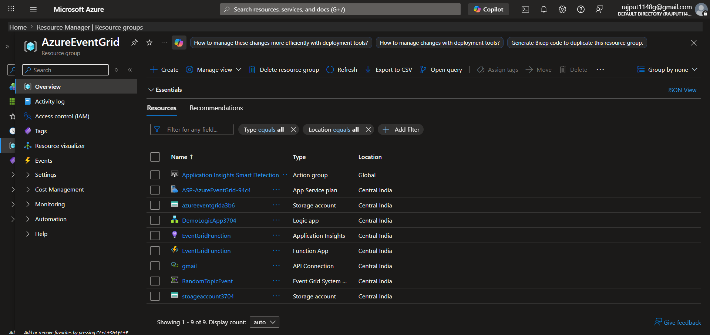
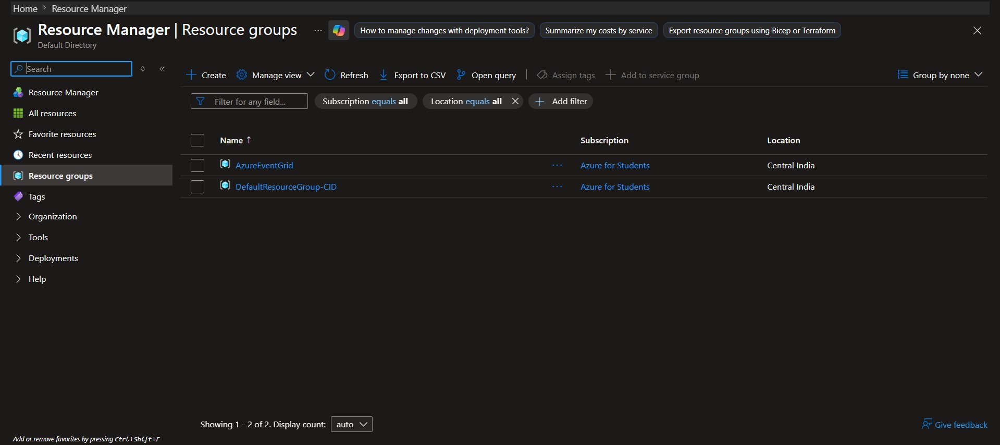
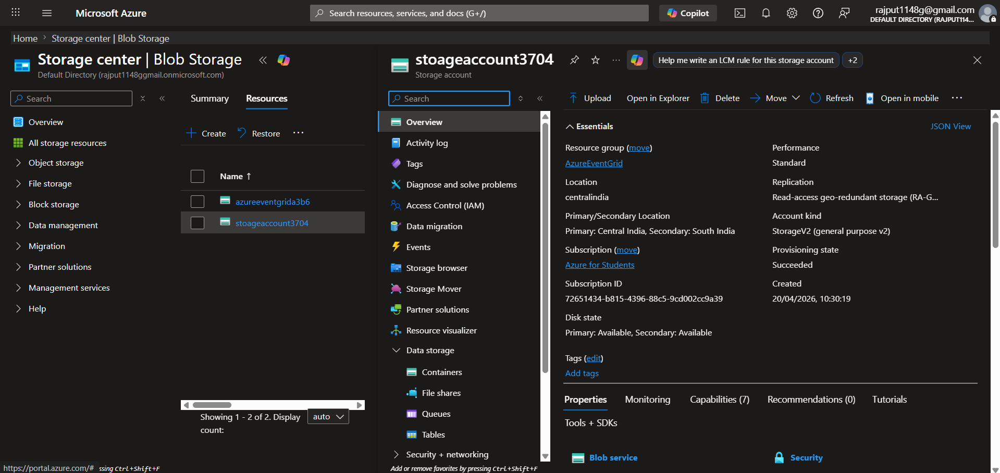
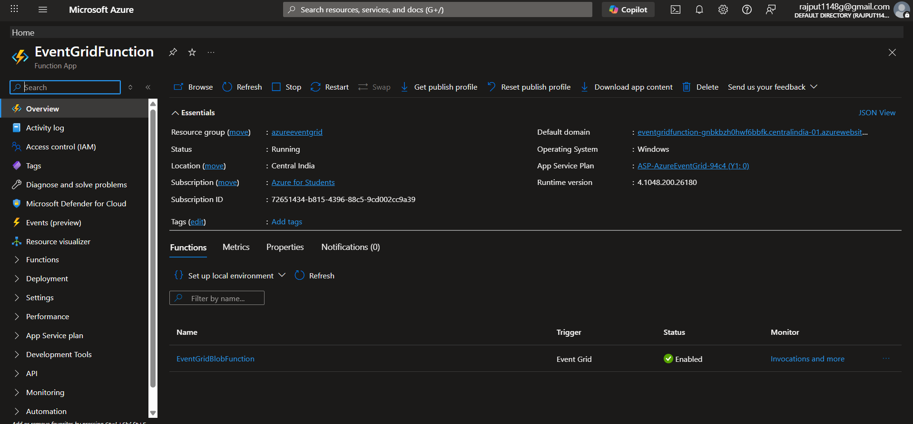
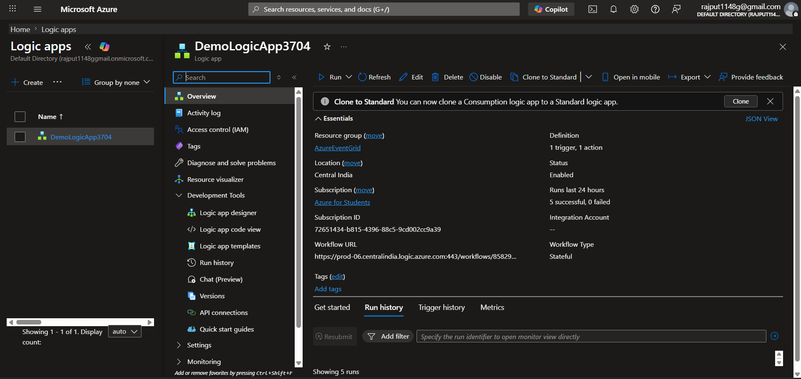
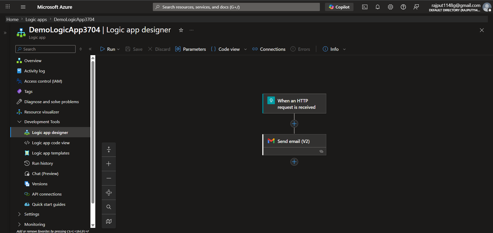
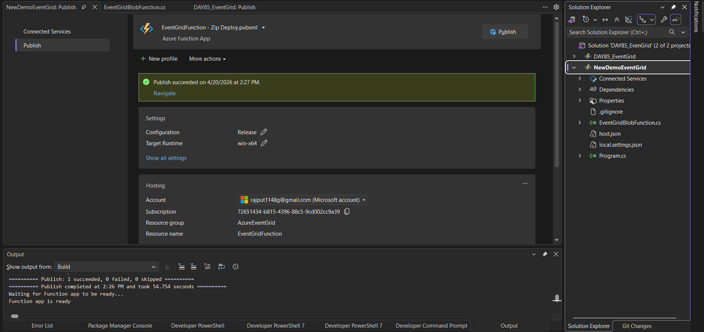
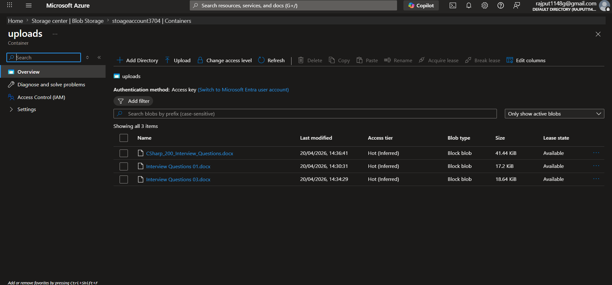
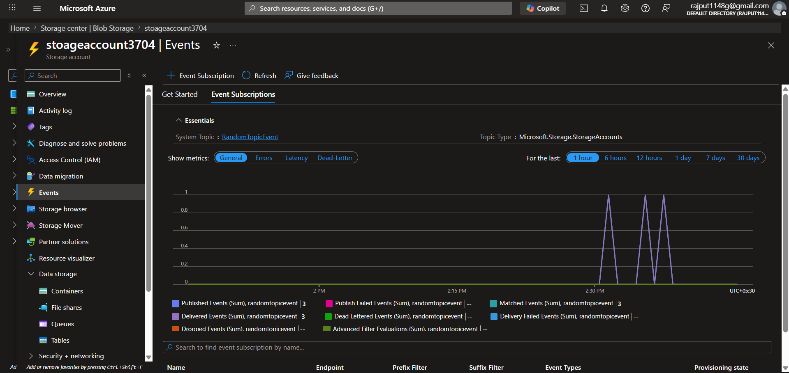

# DAY85 - Azure Event Grid with Azure Function and Logic App

This project demonstrates an event-driven Azure integration pattern using:

- Azure Blob Storage as the event producer
- Azure Event Grid as the event router
- Azure Function (Event Grid Trigger) as the processor
- Azure Logic App as the downstream workflow (for notification/automation)

The working pattern used in this solution is:

**Blob -> Event Grid -> Function -> Logic App**

---

## 1. Where Event Grid Fits

Azure Event Grid is a managed event routing service. It sits between event producers and event consumers.

Instead of tightly coupling services:

- Blob -> Function -> Logic App

you move to an event-driven, decoupled model:

- Blob -> Event Grid -> (Function / Logic App / Webhook / many subscribers)

Benefits:

- Loose coupling
- Near real-time event delivery
- Easy fan-out to multiple subscribers
- Better scalability and maintainability

---

## 2. Two Ways to Trigger on Blob Upload

### Option 1: Native Blob Trigger

Flow:

- Blob Storage -> Azure Function (Blob Trigger)

Characteristics:

- Polling-based behavior
- Very simple setup
- Possible slight delay
- Tighter coupling with storage account internals

### Option 2: Event Grid Trigger (Used in this project)

Flow:

- Blob Storage -> Event Grid -> Subscriber

Subscribers can be:

- Azure Function
- Azure Logic App
- Webhook endpoint
- Other Azure services

Characteristics:

- Push model
- Near real-time processing
- Better decoupling

---

## 3. When You Should Use Event Grid

Use Event Grid when:

1. You need near real-time processing after events occur.
2. You want to decouple producers and consumers.
3. You may need multiple independent subscribers in future.
4. You want scalable event distribution without custom routing code.

---

## 4. Project Overview (This Repository)

### Solution structure

- `DAY85_EvenGrid.slnx`
- `NewDemoEventGrid/` - .NET 8 isolated Azure Function App
- `Images/` - deployment and architecture screenshots

### Function behavior

The function in `NewDemoEventGrid/EventGridBlobFunction.cs`:

1. Receives Event Grid event (`[EventGridTrigger] EventGridEvent`).
2. Reads blob event payload JSON.
3. Extracts blob URL and file name.
4. Sends `FileName` and `BlobUrl` as JSON to Logic App HTTP endpoint.
5. Logs success/error for observability.

### Runtime and packages

- .NET 8 isolated worker
- Azure Functions v4
- Event Grid extension for isolated worker
- Application Insights integration enabled

---

## 5. Integration Pattern Used

### Pattern A: Event Grid -> Function -> Logic App

Flow:

1. Blob uploaded in Storage Account container
2. Blob Created event published to Event Grid
3. Event Grid pushes event to Function
4. Function processes payload and calls Logic App
5. Logic App runs automation (for example: send email)

Choose this pattern when you need business logic or enrichment before triggering workflow actions.

---

## 6. Setup Steps

## Step 1: Enable Event Grid on Storage Account

1. Open Azure Storage Account.
2. Go to **Events**.
3. Create Event Subscription.
4. Select Event Type: **Blob Created**.
5. Select Endpoint Type: **Azure Function** (or Logic App for direct integration).

## Step 2: Deploy Azure Function

1. Publish this function project to Azure Function App.
2. Verify Function App has Event Grid trigger function available.
3. Confirm Event Subscription endpoint is linked to this function.

## Step 3: Configure Logic App

1. Create Logic App with trigger **When an HTTP request is received**.
2. Add actions (email/notification/Teams/etc.) as needed.
3. Copy generated HTTP trigger URL.
4. Use that URL in the function call.

## Step 4: Test End-to-End

1. Upload a file into the target blob container.
2. Verify Function logs show Event Grid event received.
3. Verify Logic App run history for successful execution.
4. Validate final output notification/email.

---

## 7. Local Development

Prerequisites:

- .NET SDK 8
- Azure Functions Core Tools v4
- Azurite or valid `AzureWebJobsStorage` connection

Current local settings file includes:

- `AzureWebJobsStorage=UseDevelopmentStorage=true`
- `FUNCTIONS_WORKER_RUNTIME=dotnet-isolated`

Run locally:

```bash
dotnet build
func start
```

Event Grid trigger local endpoint format:

- `http://localhost:7071/runtime/webhooks/EventGrid?functionName=EventGridBlobFunction`

---

## 8. Important Production Note

The Logic App callback URL is currently hardcoded inside the function source.

Recommended improvement:

- Move URL to application settings (environment variable), for example `LOGIC_APP_URL`.
- Read via configuration at runtime.
- Rotate/regenerate trigger URL if exposed.

---

## 9. Screenshots (From Images folder)

## Overall Azure Resources





## Storage and Event Integration





## Logic App





## Deployment and Runtime







---

## 10. Quick Summary

This Day 85 project demonstrates a practical event-driven Azure architecture using Event Grid as the decoupling layer between Blob Storage and downstream processing.

Final architecture implemented:

**Blob Storage -> Event Grid -> Azure Function -> Logic App**

This is the recommended approach when low-latency notifications and clean service decoupling are required.
